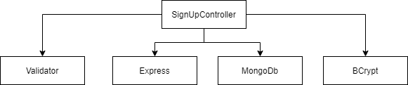
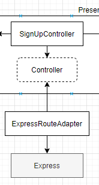
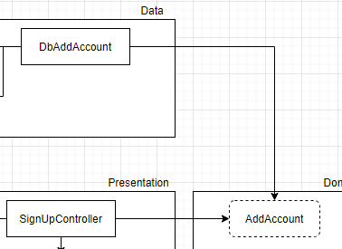
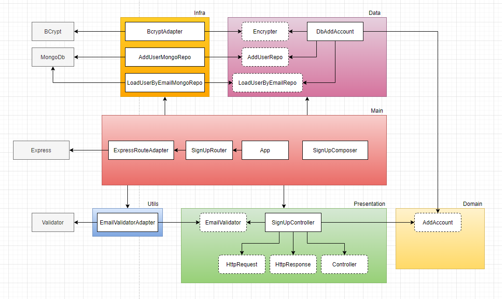

# NodeJs, Typescript, TDD, Clean Architecture e SOLID
 Praticando clean architecture e TDD com o curso do Rodrigo Mango

 # Desenho da arquitetura

Segundo o professor, o desenho a seguir é como as pessoas fazem hoje.

O problema é que o controller está acoplado aos frameworks externos de tal forma que, se for necessário mudar um desses componentes, é necessário mexer no sistema inteiro.

O desenho respresenta um componente que faz tudo no sistema.

### Como desacoplar um controller do express?

Utilizando "inversão de dependência" (dependency inversion).

Colocando um componente entre o **SignUpController** e o **Express** utilizando um padrão de projeto chamado **adapter.**

Um adapter é um adaptador de interfaces. Ele verifica o que o controller precisa e adapta para a realidade do componente que se quer adaptar, nesse caso o Express.

O Express espera receber o "req" e o "res" (request and response) o qual o controller não vai ter conhecimento. Assim o controller não vai acoplar ao express.

Não existe mágica, para desacoplar algo, você acopla outra coisa. Nesse caso, o adapter fica acoplado ao express. 

Se algum dia for necessário trocar o express, você só vai precisar mexer no adapter.

## Algumas explicações sobre as camadas utilizadas do projeto baseadas em Clean Architecture

- **Presentation Layer:** como o nome sugere, é a camada responsável por apresentar os dados ao usuário.
- **Util:** camada mais genérica para colocar coisas que podem ser utilizadas em qualquer lugar.
- **Domain Layer**: aonde ficam as regras de negócio da aplicação. No clean architecture, essa camada não vai ter implementações, tendo apenas protocolos e interfaces que dizem quais são as regras de negócio que a aplicação tem.
- **Data Layer:** aonde são feitas implementações da regra de negócio.
- **Infra Layer**: essa camada faz implementações de interfaces voltadas para frameworks.
- **Main Layer**: pra gente desacoplar nossas camadas, precisamos acoplar uma delas, essa é a função dessa camada. Vai criar a instância de tudo e fazer a composição de tudo (design pattern: composite)

### Como é feita instância das implementações de domínio na apresentação?

Utiliza Injeção de Dependência (Dependency Injection). Alguém vai criar uma instância do componente necessário e vai injetar dentro da campada de apresentação. 

Na imagem, a injeção de dependência vai injetar uma instância do DbAddAccount dentro do SignUpController.

## Diagrama de Componentes do Projeto

